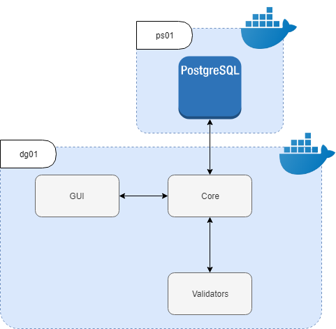
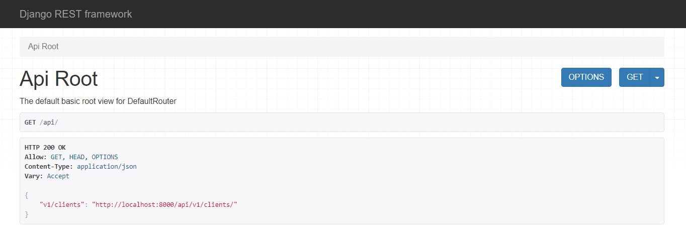

======================
Architecture
======================

In this section the system architecture will by explained.
The system is based in a docker container architecture, specifically 2 container:

1. dg01 container: based in python container, contains the system's core, including validators, serializers and user interface.

2. ps01 container: based in postgresql container, it store client data.

System Core
#############

In this section all components of the system's core will be explained.

System Validators
###################

All field including in the forms used for store client data are validating following this rules.

* Name: only can include letters.
* Surname: only can include letters.
* IBAN account: check valid country-code and checksum digits.

System User Interface
#######################

Created using DRF default templates to navigate for the browsable API, and a custom login view to allow
sing in using a google account.

System API Endpoints
#######################

Created using DRF, in this section the different endpoints and operation allowed will be explained.

**Clients**

==========   =========================   ================================
Operation    Endpoint                    Description
==========   =========================   ================================
GET          /v1/clients                 retrieve all stored data
GET          /v1/clients/[client-id]     retrieve client stored data
POST         /v1/clients                 insert client stored data
DELETE       /v1/clients/[client-id]     delete client stored data
PUT          /v1/clients/[client-id]     update client stored data
PATCH        /v1/clients/[client-id]     update client stored data
==========   =========================   ================================

