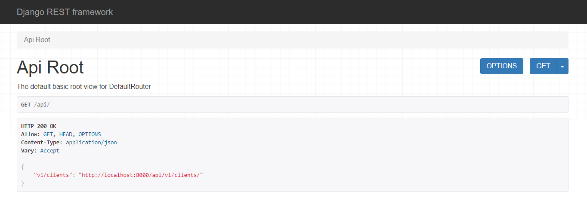
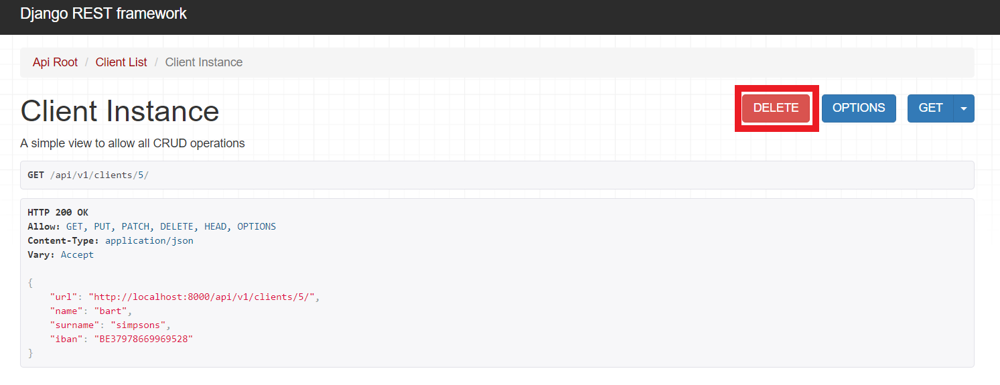

=======================================
Management
=======================================

In this section How to use the system will by explained

Access
##########

To access the system you only need a google account and access to http://localhost:8000 (with the system up)
and Sign in.

when are successfully log in, you will see the API root view and you can start to navigate inside the whole
system

then you can choose the desired endpoint (clients) and client list will be shown.

Client List View
##################

Show all client stored in the system. Consists of 2 component.

1. view panel, where results are shown

2. Form panel to introduce data for store new clients.

Basic Operations
###################

In this section system basic operation will be described

Retrieve all clients
============================

In the client view pick in the top blue button (GET).

then the client list are shown in the client's view panel.

Store new clients
============================

Fill the client form with the required data and pick in blue down button (POST).

Update client data
============================

Choose the client you want update and pick in url field.

this show you a new view with a new panel at the bottom, change the required data and click in the
blue button (PUT).

.. note::
    Update it's only allowed if you are the owner of the client.

Delete client data
============================

Choose the client you want delete and pick in url field.

this show you a new view, then click in the red button (DELETE).

.. note::
    Delete it's only allowed if you are the owner of the client.